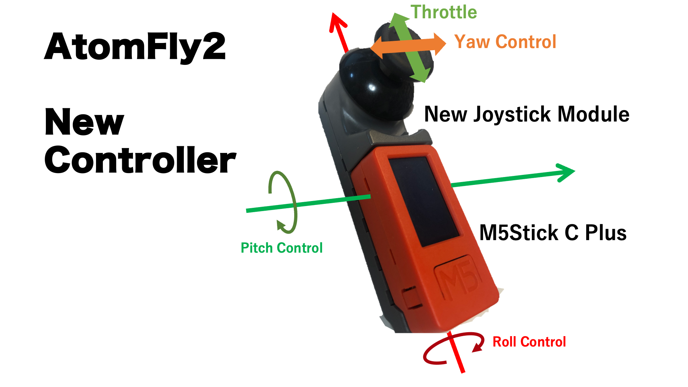

# atomfly_kanazawa

AtomFlyの飛行制御プログラムを作っていきます。

[pico_copter](https://github.com/kouhei1970/pico_copter)を一部流用します。

### ビルド環境

#### Vscode

##### Ubuntu

1. [こちら](https://code.visualstudio.com/Download)から.debパッケージをダウンロード
2. ダウンロードしたフォルダにて
```
dpkg -i debファイル名
```

##### Mac
```
brew install --cask visual-studio-code
```

##### Win
[こちら](https://code.visualstudio.com/Download)からインストーラーをダウンロードして実行


#### PlattofomIO
1. [公式ページ](https://platformio.org/)https://platformio.org/
2. [参考](https://qiita.com/JotaroS/items/1930f156aab953194c9a)https://qiita.com/JotaroS/items/1930f156aab953194c9a

#### git
##### Ubuntu
たぶんインストール済み
```
apt install git
```

##### Mac
```
brew install git
```

##### Win

[こちら](https://gitforwindows.org/)からインストーラをダウンロードしてください

### ビルド
#### リポジトリのクローン
適当なディレクトリにて
```
git clone https://github.com/kouhei1970/atomfly_kanazawa
```

#### AtomFly2のファームのビルドと書き込み
1. vscode（PltformIO）を開いて、atomfly2プロジェクトを開く
2. 下部のCheck markのアイコンをクリックしてビルドを実行
3. M5ATOM Liteに書き込む

###＃ 操縦コントローラのファームのビルドと書き込み

1. vscode（PltformIO）を開いて、atomfly2_minijoycプロジェクトを開く
2. 先ほどファームを書き込んだAtomFly2をPCと接続してシリアルモニタを開く
3．　M5ATOM Liteをリセットする
4.　シリアルモニタにMACアドレスが表示されるのでメモをする
5. main.cppファイルの５４行目に付近にMACアドレスを指定する部分があるので、先ほどメモしたアドレスに書き換える
2. 下部のCheck markのアイコンをクリックしてビルドを実行
3. M5StickC Pulseに書き込む


